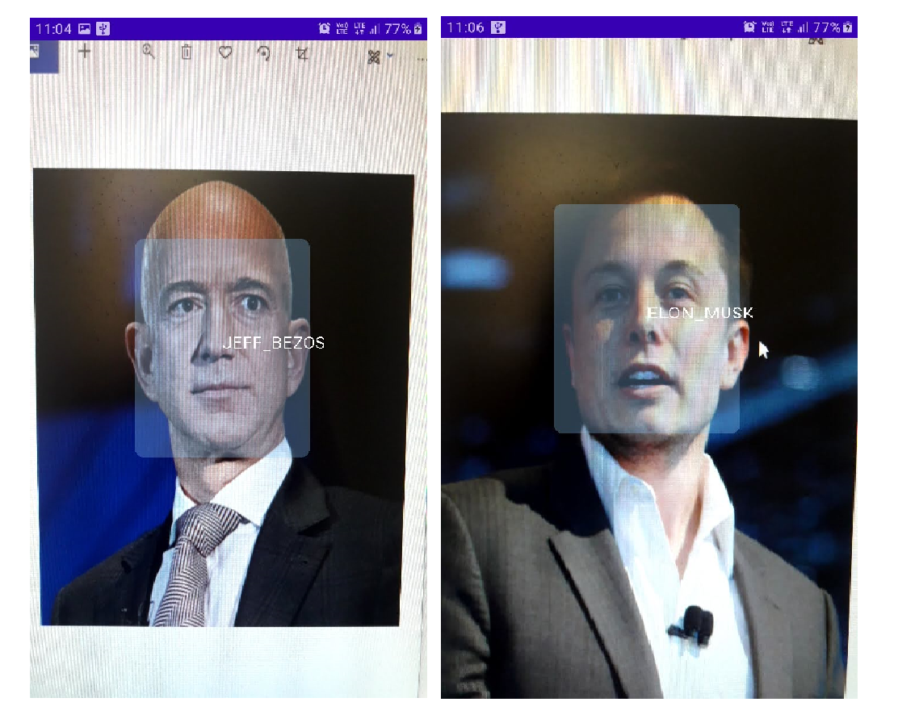
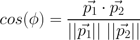

[](https://medium.com/@equipintelligence/using-facenet-for-on-device-face-recognition-with-android-f84e36e19761)

>> **Store images of people who you would like to recognize and the app, using these images, will classify those people. We don't need to modify the app/retrain any ML model to add more people ( subjects ) for classification**





# Face Recognition and Classification With FaceNet On Android

If you're ML developer, you might have heard about FaceNet, Google's state-of-the-art model for generating face embeddings. In this 
project, we'll use the FaceNet model on Android and generate embeddings ( fixed size vectors ) which hold information of the face.


## About FaceNet

So, the aim of the FaceNet model is to generate a 128 dimensional vector of a given face. It takes in an 160 * 160 RGB image and 
outputs an array with 128 elements. How is it going to help us in our face recognition project? 
Well, the FaceNet model generates similar face vectors for similar faces. Here, my the term "similar", we mean 
the vectors which point out in the same direction. We calculate this similarity by measuring cosine of the angle between the two 
given 128 dimensional vectors.



In this app, we'll generate two such vectors and find the similarity between them. The one which has the highest similarity is our 
desired output.

You can download the FaceNet Keras `.h5` file from this [repo](https://github.com/nyoki-mtl/keras-facenet).

## Usage

So, an user can store images in his/her device in a specific folder. If, for instance, the user wants the app to recognize
 two people namely "Rahul" and "Neeta". So the user needs to store the images by creating two directories namely "Rahul" and "Neeta" 
 and store their images inside of these directories.
 
```
images ->
    Rahul ->
          image_rahul.png
    Neeta ->
          image_neeta.png
```

The app will then process these images and classify these people thereafter. For face recognition, Firebase MLKit is used which 
fetches bounding boxes for all the faces present in the camera frame.

> This is different from existing face recognition apps as the user does not programme the app in such to recognize only a 
fixed number of persons. If a new person is to be recognized, the system ( app ) has to be modified to include the new person as 
well.

## Working

The app's working is described in the steps below. The corresponding code is present in the file written in brackets.

1. Scan the `images` folder present in the internal storage. Next, parse all the images present within `images` folder and store 
the names of sub directories within `images`. For every image, collect bounding box coordinates ( as a `Rect` ) using Firebase ML 
Kit. Crop the face from the image ( the one which was collected from user's storage ) using the bounding box coordinates. 

2. Finally, we have a list of cropped `Bitmap` of the faces present in the images. Next, feed the cropped `Bitmap` to the FaceNet 
model and get the embeddings ( as `FloatArray` ). Now, we create a `HashMap<String,FloatArray>` object where we store the names of 
the sub directories as keys and the embeddings as their corresponding values. 

The above procedure is carried out only on the app's startup. The steps below will execute on each camera frame.

1. Using `androidx.camera.core.ImageAnalysis`, we construct a `FrameAnalyser` class which processes the camera frames. Now, for a 
given frame, we first get the bounding box coordinates ( as a `Rect` ) of all the faces present in the frame. Crop the face from 
the frame using these boxes.
2. Feed the cropped faces to the FaceNet model to generate embeddings for them. Using cosine similarity, calculate the similarity 
scores for all subjects ( which we stored earlier as `HashMap<String,FloatArray>` ). The one with highest similarity is 
determined. The final output is then stored as a `Prediction` and passed to the `BoundingBoxOverlay` which draws boxes and 
text.

## Firebase Services

The app uses Firebase MLKit API, so you'll need to connect this app to a Firebase project. You may update the Firebase dependencies and make sure you add the google-services.json file to the app.

See the [instructions from Firebase](https://firebase.google.com/docs/android/setup).

## Libraries

1. [Firebase MLKit](https://firebase.google.com/docs/ml-kit/detect-faces) for face recognition.
2. [TensorFlow Lite Android](https://www.tensorflow.org/lite)
3. [TensorFlow Lite Android Support Library](https://github.com/tensorflow/tensorflow/tree/master/tensorflow/lite/experimental/support/java)
4. [CameraX](https://developer.android.com/training/camerax)

